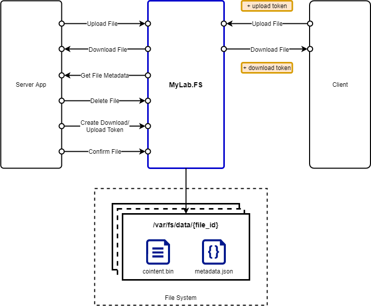
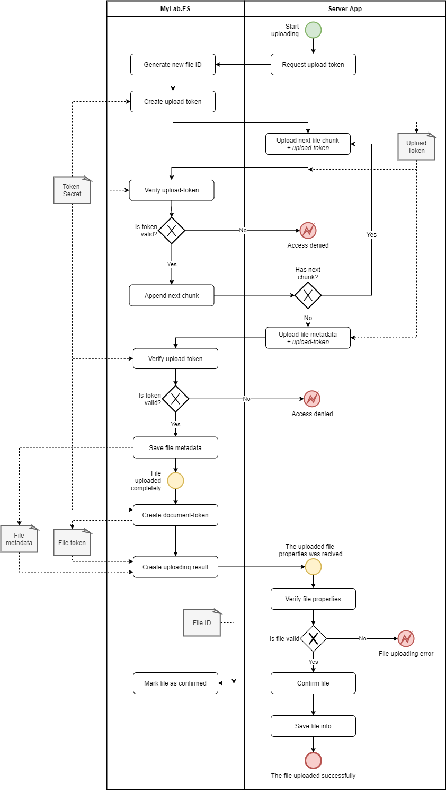
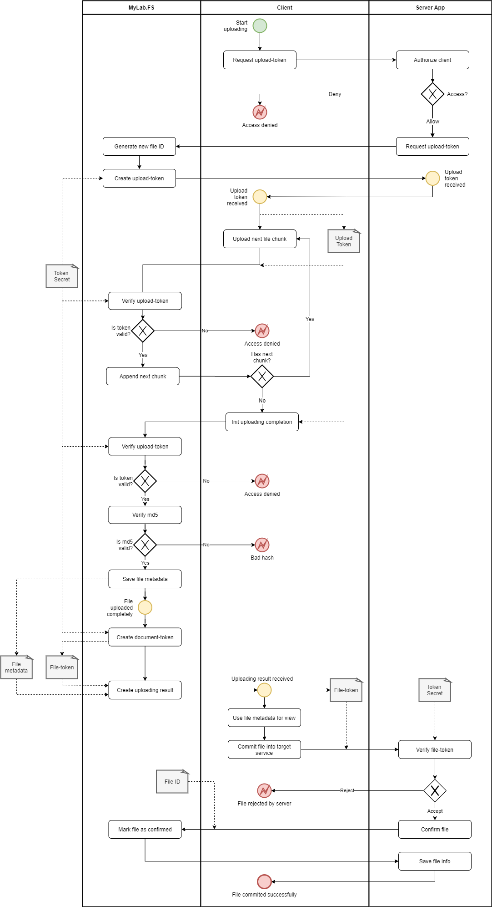
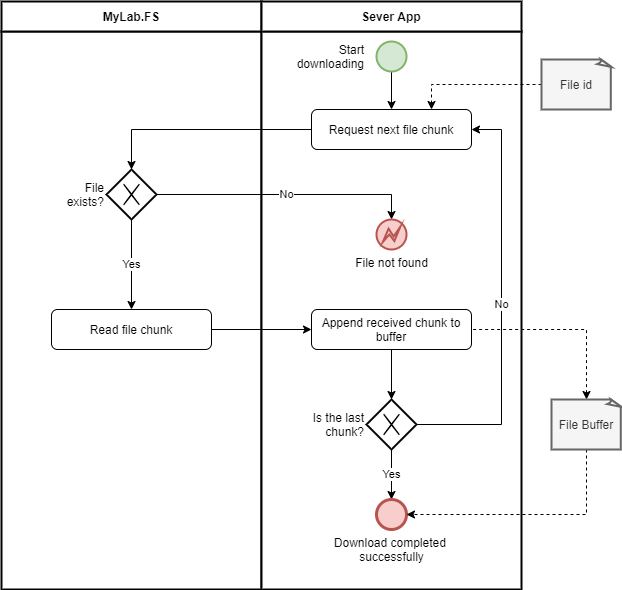
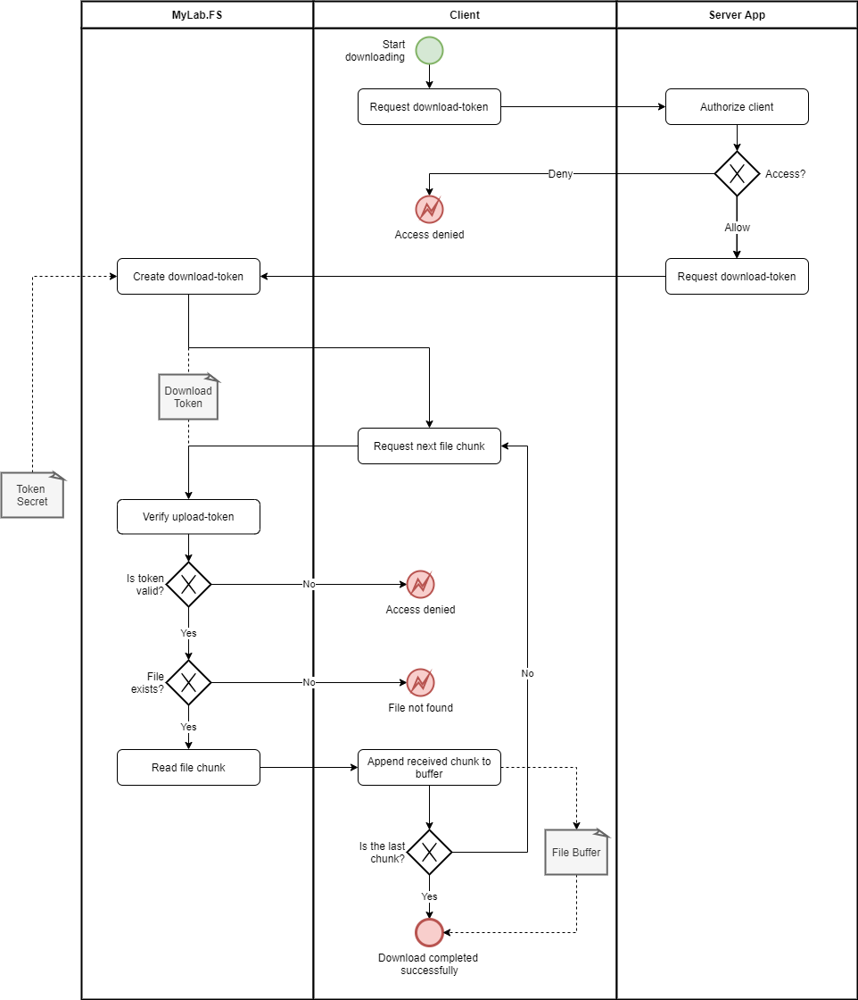

# MyLab.FileStorage (FS)

`MyLab.FS` - файловое хранилище с прямым авторизованным доступом клиента.

Ознакомьтесь с последними изменениями в [журнале изменений](/CHANGELOG.md).

## Обзор 

`MyLab.FS` - сервис, предназначенный для обеспечения функций хранения в информационной системе с авторизованным доступом клиентов.

Сервис позволяет загружать, хранить и скачивать файлы. Есть методы доступа с авторизацией для клиентов и без авторизации - для компонентов серверного приложения. 

*API хранилища не разделено каким либо образом на предназначенное для сервера и - для клиента, т.к. вопросы организации доступа к HTTP-API не является задачей данного сервиса.* 



Файлы хранятся в файловой системе сервера, где развёрнуто *файловое хранилище*. Каждый файл представляет директория, путь к которой строится с использованием идентификатора файла. 

*Хранилище не обеспечивает резервирования, теневого копирования, кластеризацию и другие средства обеспечения целостности хранящихся данных. Для этих целей используйте сторонние решения.*

Эта директория содержит файлы:

* `content.bin` - содержательная часть файла;
* `metadata.json` - метаданные файла.

Ниже приведён пример метаданных файла:

```json
{
  "id": "94b721e7bbfe4109864dcd8bef70d48e",
  "created": "2001-01-01 21:22:23",
  "md5": "e807f1fcf82d132f9bb018ca6738a19f",
  "filename": "doc.txt",
  "labels": {
    "owner": "user@host.com",
    "sign": "b2xvbG8="
  }
}
```

, где:

* `id` - уникальный идентификатор файла в формате;
* `created` - дата и время появления файла в хранилище;
* `md5` - `MD5` хэш файла в формате `HEX` строки;
* `filename` - имя файла;
* `labels` - произвольные метки в формате ключ-значение, имеющие значение в предметной области приложения.

## Авторизация на токенах

Для загрузки файла клиентом, серверное приложение должно запросить у *файлового хранилища* токен загрузки и передать его этому авторизованному клиенту. Далее клиент загружает файл напрямую в *файловое хранилище*, прикладывая выданный токен. Таким образом право на загрузку файла выдаёт серверное приложение в соответствии со своими бизнес-правилами. Токен загрузки - `JWT` токен с `HMAC-SHA256` подписью.

В результате загрузки файла, клиент получает токен файла - подписанные данные о файле. Токен файла - `JWT` токен с `HMAC-SHA256` подписью. Получив этот токен от клиента, серверное приложение проверяет подпись токена, время его действия, а так же другие реквизиты в соответствии со своим бизнес-правилами. Например, лимит по размеру. 

Для проверки подписи токена файла приложение должно разделять секрет с `файловым хранилищем*, которым оно подписывает токены документов. После проверки, серверное приложение применяет полученные данные в соответствии со своим бизнес-процессом.

Для скачивания файла клиентом, серверное приложение должно запросить у *файлового хранилища* токен скачивания и передать его этому авторизованному клиенту. Далее клиент скачивает файл напрямую из *файлового хранилища*, прикладывая выданный токен. Таким образом право на скачивание файла выдаёт серверное приложение в соответствии со своими бизнес-правилами. Токен скачивания - `JWT` токен с `HMAC-SHA256` подписью.

При необходимости передать файл клиенту, серверное приложение может загрузить файл в *файловое хранилище* путём межсервисного взаимодействия, используя методы загрузки файла без авторизации (просто указав идентификатор файла) и запросить токен скачивания, который передаст клиенту. 

При необходимости получить файл, серверное приложение может скачать файл из файлового хранилища путём межсервисного взаимодействия, используя методы скачивания файла без авторизации (просто указав идентификатор файла).

В целом, применение токенов для скачивания, загрузки и передачи данных о загруженном файле в целевое серверное приложение, позволяет максимально отделить серверное приложение от файлового хранилища. И не посвящать его в детали механизмов загрузки/скачивания файлов.

При этом методы загрузи и скачивания файлов с использованием токенов можно опубликовать без специфической авторизации серверного приложения, где будет использоваться *файловое хранилище*. Скачивание файла осуществляется `GET` запросом с указанием токена скачивания в `query` параметре. Это позволяет осуществлять скачивание стандартными механизмами браузеров.

При использовании микросервисной архитектуры разделение обязанностей микросервисов позволяет более эффективно использовать подход с токенами: одни микросервисы могут вести учёт загруженных файлов (взаимодействовать с клиентами); другие - использовать ранее сохранённые идентификаторы загруженных файлов и брать их из `файлового хранилища` для обработки. 

## Загрузка файла

### Загрузка сервером

Загрузка серверным приложением осуществляется без авторизации и состоит из следующих шагов:

* запрашивает токен загрузки;
* отправляет файл частями, прикладывая токен загрузки;
* завершает загрузку, указав контрольную сумму, метаданные и приложив токен загрузки;
* получает метаданные загруженного файла и подписанный токен файла.



### Загрузка клиентом

Загрузка клиентом осуществляется с использование токена загрузки. Токен загрузки клиент получает у серверного приложения, которое в свою очередь предварительно авторизует пользователя и запрашивает для него токен у *файлового хранилища*. По окончании загрузки файла, клиент получает от *файлового хранилища* подписанный токен файла и передаёт его целевому приложению, которое проверяет достоверность токена и применяет полученные данные в соответствии со своей логикой.



## Скачивание файла

### Скачивание сервером

Скачивание серверным приложением осуществляется без авторизации и заключается в запросе содержания файла по частям.



### Скачивание клиентом

Скачивание клиентом осуществляется с использование токена скачивания. Токен скачивания клиент получает у серверного приложения, которое в свою очередь предварительно авторизует пользователя и запрашивает для него токен у *файлового хранилища*. После получения токена загрузки, клиент запрашивает содержание файла по частям. 



