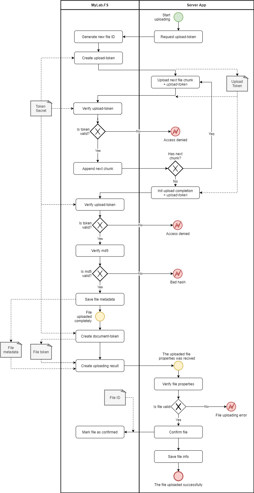

# MyLab.FileStorage (FS)

`MyLab.FS` - файловое хранилище с прямым авторизованным доступом клиента.

Ознакомьтесь с последними изменениями в [журнале изменений](/CHANGELOG.md).

## Обзор 

`MyLab.FS` - сервис, предназначенный для обеспечения функций хранения в информационной системе с авторизованным доступом внешних клиентов.

Сервис позволяет загружать, хранить и скачивать файлы. Есть методы доступа с авторизацией для внешних клиентов и без авторизации - для внутренних доверенных клиентов. 

*API хранилища не разделено каким либо образом на внешний и внутренний, т.к. вопросы организации доступа к HTTP-API не является задачей данного сервиса.* 


Файлы хранятся в файловой системе сервера, где развёрнуто *файловое хранилище*. Каждый файл представляет директория, путь к которой строится с использованием идентификатора файла. 

*`MyLab.FS` не обеспечивает резервирования, теневого копирования, кластеризацию и другие средства обеспечения целостности хранящихся данных. Для этих целей используйте сторонние решения.*

Эта директория содержит файлы:

* `content.bin` - содержательная часть файла;
* `metadata.json` - метаданные файла.

Ниже приведён пример метаданных файла:

```json
{
  "id": "94b721e7bbfe4109864dcd8bef70d48e",
  "created": "2001-01-01 21:22:23",
  "md5": "e807f1fcf82d132f9bb018ca6738a19f",
  "filename": "doc.txt",
  "labels": {
    "owner": "user@host.com",
    "sign": "b2xvbG8="
  }
}
```

, где:

* `id` - уникальный идентификатор файла в формате;
* `created` - дата и время появления файла в хранилище;
* `md5` - `MD5` хэш файла в формате `HEX` строки;
* `filename` - имя файла;
* `labels` - произвольные метки в формате ключ-значение, имеющие значение в предметной области приложения.

## Загрузка файла

### Загрузка доверенным приложением

Загрузка доверенным приложением осуществляется без авторизации и состоит из следующих шагов:

* запрашивает токен загрузки;
* отправляет файл частями, прикладывая токен загрузки;
* завершает загрузку, указав контрольную сумму, метаданные и приложив токен загрузки;
* получает метаданные загруженного файла и подписанный токен файла.



### Загрузка внешним клиентом

Загрузка внешним клиентом осуществляется с использование токена загрузки. Токен загрузки клиент получает у серверного приложения, которое в свою очередь предварительно авторизует пользователя и запрашивает для него токен у *файлового хранилища*. По окончании загрузки файла, клиент получает от  *файлового хранилища* подписанный токен файла и передаёт его целевому приложению, которое проверяет достоверность токена и применяет полученные данные в соответствии со своей логикой.


Применение токена загрузки позволяет избежать внедрения авторизации приложения для `файлового хранилища` или разработки "оборачивающих" `API`. При этом целевое приложение, которому предназначается файл, освобождено от необходимости заниматься передачей файлов. Ответственность приложения - авторизовать пользователя и запросить для него токен загрузки. 